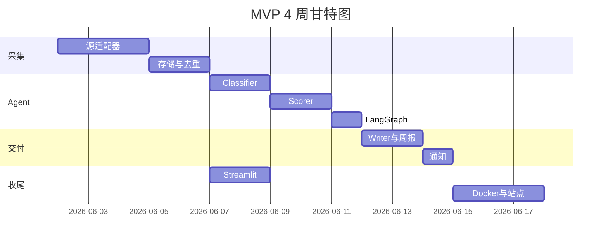

# AI 技术情报雷达 — 项目规划书

**版本**：v1.0 · **日期**：2026-05-28  
**适用对象**：AI 应用 Lab（5–8 人）· 1–2 人开发 · 4 周 MVP + 4 周实习延伸  

---

## 1. 项目概述

### 1.1 背景与痛点

| 痛点 | 现状 | 目标 |
|------|------|------|
| 信息过载 | 成员各自刷 RSS / 群 / X，重复劳动 | 统一入库、去重、结构化 |
| 评估标准不一 | 「这篇论文很火」≠「我们本周该试」 | Lab 语境 Rubric + 三档推荐 |
| 决策无追溯 | 口头讨论，难复盘「当时为何没跟」 | 周报 + 证据链 + 归档检索 |
| 周度节奏错位 | 日更资讯 vs 周度立项 | **日采 + 周编**，匹配 Lab 站会 |

### 1.2 项目目标（SMART）

- **S**：交付可运行的情报雷达 MVP（采集 → Agent 评估 → 周报 → 看板）
- **M**：连续 2 周自动周报；编辑复核 < 30 min/周；重复报道率 < 10%
- **A**：1–2 名开发 + 轮值编辑；单机部署
- **R**：仅使用公开源与 LLM API，不爬私有数据
- **T**：4 周 MVP；第 5–8 周实习延伸

### 1.3 成功标准

1. 决策者确认：至少 2 条情报影响「本周是否试用」判断  
2. 技术：3 个 P0 源稳定、LangGraph 三 Agent 可回归测试  
3. 文档：方案报告 + 架构图 + LLM 说明 + 本规划书 + 在线站点  

---

## 2. 范围与 WBS

```
AI-Tech-Intelligence-Radar
├── W1 采集与存储        [5d]  adapters, SQLite, 去重
├── W2 Agent 流水线      [5d]  Classifier, Scorer, focus.yaml
├── W3 周报与通知        [5d]  Writer, Jinja2, 飞书/邮件
├── W4 看板与运维        [5d]  Streamlit, 日志, Docker, 文档站
└── 延伸（月2）          [20d] Twitter, 回访, RAG, 任务单
```

| WBS ID | 工作包 | 负责人 | 工期 | 依赖 |
|--------|--------|--------|------|------|
| 1.1 | 源适配器（arXiv/HF/GitHub） | Dev A | 3d | — |
| 1.2 | SQLite 模型 + 去重 | Dev A | 2d | 1.1 |
| 2.1 | Classifier Agent + Schema | Dev B | 2d | 1.2 |
| 2.2 | Scorer Agent + Rubric | Dev B | 2d | 2.1 |
| 2.3 | LangGraph 编排 | Dev B | 1d | 2.2 |
| 3.1 | Writer + 周报模板 | Dev B | 2d | 2.3 |
| 3.2 | 通知通道 | Dev A | 1d | 3.1 |
| 3.3 | 编辑复核流程 SOP | 编辑 | 1d | 3.1 |
| 4.1 | Streamlit 看板 | Dev B | 2d | 1.2 |
| 4.2 | 调度 / Docker / CI | Dev A | 2d | 3.2 |
| 4.3 | GitHub Pages 站点 | Dev A | 1d | 3.1 |

---

## 3. 里程碑与甘特（4 周）

| 周次 | 里程碑 | 验收物 | 日期（示例） |
|------|--------|--------|--------------|
| **W1** | M1 数据入库 | CLI 列出新条目；≥3 源稳定 | D+5 |
| **W2** | M2 智能评估 | 每条带类型、五维分、三档推荐 | D+10 |
| **W3** | M3 第一份周报 | `reports/YYYY-WW.md` + 通知送达 | D+15 |
| **W4** | M4 生产就绪 | 看板 + 连续 1 周无人值守采集 | D+20 |
| **W5–8** | M5 延伸 | 回访、RAG、任务单（可选） | D+40 |



---

## 4. 组织与角色

| 角色 | 人数 | 职责 |
|------|------|------|
| **产品负责人** | Lab 负责人 1 | 确认 focus.yaml、Rubric 权重、源优先级 |
| **开发 A** | 1 | 采集、DB、调度、DevOps |
| **开发 B** | 1 | Agent、Prompt、周报、看板 |
| **轮值编辑** | 每周 1 人 | 复核周报 <30min，修正误分类 |
| **决策者** | 1–2 | 阅读「本周必读」，拍板是否投入 |

**沟通机制**：每周一 15min 站会（进度/阻塞）；每周五 10:30 周报发布会。

---

## 5. 资源与预算

### 5.1 人力

| 阶段 | 人天 | 说明 |
|------|------|------|
| MVP（4 周） | 40 PD | 2 人 × 10 天/人（按 50% 投入计 20 有效人天/人） |
| 延伸（4 周） | 20 PD | 1 实习生全职 |

### 5.2 基础设施（月）

| 项 | 规格 | 费用（估） |
|----|------|------------|
| 计算 | Lab 内 Linux 虚拟机 2C4G | ¥0（存量） |
| LLM API | 周 200–400 条 × 摘要+打分 | ¥200–800 |
| 存储 | SQLite + <5GB 原始 JSON | ¥0 |
| 域名（可选） | GitHub Pages 免费 | ¥0 |

### 5.3 软件栈

Python 3.11 · LangGraph · SQLite · Chroma · APScheduler · Streamlit · Jinja2 · Docker Compose

---

## 6. 风险管理

| ID | 风险 | 概率 | 影响 | 应对 |
|----|------|------|------|------|
| R1 | LLM 幻觉导致错误推荐 | 中 | 高 | 仅引用 metadata；人工复核；回归测试集 |
| R2 | 源 API 变更/限流 | 高 | 中 | 每源独立 adapter；降级跳过 + 告警 |
| R3 | 4 周 scope 膨胀 | 中 | 高 | 严格 MVP 清单；P2 源进 backlog |
| R4 | 编辑负担反弹 | 中 | 中 | Top-N 限制；模板化复核 checklist |
| R5 | 无 GitHub/密钥导致无法部署 | 低 | 中 | Demo 离线模式；文档化 env 模板 |

---

## 7. 质量与测试

| 类型 | 内容 | 通过标准 |
|------|------|----------|
| 单元测试 | 去重、URL 规范化、Rubric 加权 | pytest 覆盖率核心模块 >70% |
| 集成测试 | 采集 → DB → Agent（mock LLM） | 端到端 <5min |
| 人工评测 | 50 条历史条目 Scorer 与专家标注一致率 | ≥75% 档位一致 |
| 试运行 | 连续 2 周真实周报 | 编辑 <30min，决策者满意度 ≥4/5 |

---

## 8. 交付清单（与测试题对齐）

| # | 交付物 | 路径 | 状态 |
|---|--------|------|------|
| 1 | 方案设计报告（3–5 页，四章） | [report.md](./report.md) | ✅ |
| 2 | 架构图（Mermaid） | [../diagrams/architecture.mmd](../diagrams/architecture.mmd) | ✅ |
| 3 | LLM 使用说明 | [llm-usage.md](./llm-usage.md) | ✅ |
| 4 | 项目规划书（本文） | project-plan.md | ✅ |
| 5 | 可运行 Demo | [../src/](../src/) | ✅ |
| 6 | 在线文档站 | GitHub Pages → `docs/index.html` | ✅ |
| 7 | 示例周报 | [../reports/sample_weekly_report.md](../reports/sample_weekly_report.md) | ✅ |

---

## 9. 上线与运维

1. **部署**：`docker compose up -d` 或 crontab 调用 `python -m radar.cli run`  
2. **监控**：日志 `logs/radar.log`；源失败邮件/飞书告警  
3. **备份**：每周拷贝 `data/radar.db` 与 `reports/`  
4. **迭代**：每季度校准 `focus.yaml` 与 Rubric 权重  

---

## 10. 附录：本周站会议程模板

1. 上周「关注」条目跟进（5 min）  
2. 本周必读 Top-3 讨论（15 min）  
3. 是否生成试用任务单（5 min）  
4. 系统问题 / 源调整（5 min）  

---

*本规划书与 [report.md](./report.md) 配套使用；实施进度请在 README 里程碑表中勾选更新。*
