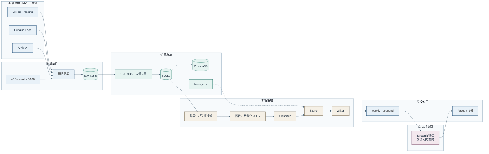
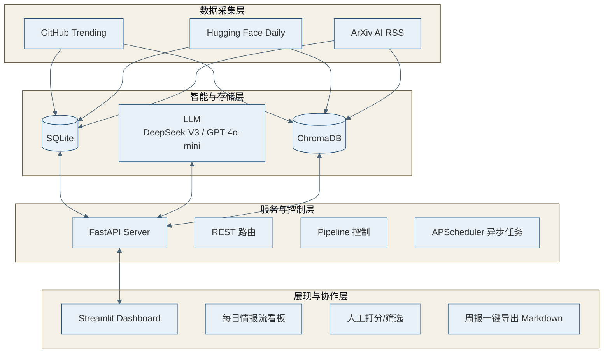

# AI 技术情报雷达 — 方案设计报告

> **项目名称**：AI 技术情报雷达系统 MVP 方案设计  
> **题目**：AI 应用 Lab 管培生 / 实习生测试题  
> **参考依据**：《AI 应用 Lab 管培生测试题》任务场景与交付要求  
> **项目排期**：1–2 人 / 4 周落地可用 MVP，后续逐步演进  
> **版本**：v3.0（对照参考方案补全）  
> **日期**：2026-05-28  
> **GitHub**：[FBB123571/AI-Tech-Intelligence-Radar](https://github.com/FBB123571/AI-Tech-Intelligence-Radar)

---

## 交付物与在线链接

| 类型 | 说明 | 链接 |
|------|------|------|
| **GitHub 代码仓库** | 方案、Demo、PoC 示例、网站源码 | https://github.com/FBB123571/AI-Tech-Intelligence-Radar |
| **在线文档站（GitHub Pages）** | 报告导航、架构图、周报预览 | https://fbb123571.github.io/AI-Tech-Intelligence-Radar/ |
| **本报告（主交付 Markdown）** | 完整方案（本文） | [docs/report.md](https://github.com/FBB123571/AI-Tech-Intelligence-Radar/blob/main/docs/report.md) |
| **项目规划书** | WBS、甘特、预算、风险 | [docs/project-plan.md](https://github.com/FBB123571/AI-Tech-Intelligence-Radar/blob/main/docs/project-plan.md) |
| **LLM 使用说明** | AI 协作透明度 | [docs/llm-usage.md](https://github.com/FBB123571/AI-Tech-Intelligence-Radar/blob/main/docs/llm-usage.md) |
| **逻辑架构图** | Mermaid 源文件 | [diagrams/architecture.mmd](https://github.com/FBB123571/AI-Tech-Intelligence-Radar/blob/main/diagrams/architecture.mmd) |
| **实现架构图** | FastAPI + Streamlit 四层 | [diagrams/architecture-impl.mmd](https://github.com/FBB123571/AI-Tech-Intelligence-Radar/blob/main/diagrams/architecture-impl.mmd) |
| **CLI Demo** | `python src/radar/cli.py demo` | [src/radar/](https://github.com/FBB123571/AI-Tech-Intelligence-Radar/tree/main/src/radar) |
| **FastAPI / Streamlit PoC** | 报告 §7 对应代码 | [src/examples/](https://github.com/FBB123571/AI-Tech-Intelligence-Radar/tree/main/src/examples) |
| **示例周报** | Demo 生成 | [reports/sample_weekly_report.md](https://github.com/FBB123571/AI-Tech-Intelligence-Radar/blob/main/reports/sample_weekly_report.md) |

**本地路径**：`/mnt/sdb1/leijh/AI-Tech-Intelligence-Radar`（Windows：`D:\mnt\sdb1\leijh\AI-Tech-Intelligence-Radar`）

---

## 执行摘要

为 **5–8 人 AI 应用 Lab** 设计「技术情报雷达」：**日采、周编、人机协同复核**。MVP 严格限定 **GitHub Trending + Hugging Face Daily + ArXiv AI** 三大高信噪比源；通过 **URL/向量去重 + 两阶段 LLM 提炼 + Streamlit 人工筛选**，输出带证据链的周报初稿，辅助周度「是否投入」决策。

**架构双视图**：① 逻辑流水线（Classifier → Scorer → Writer，可用 LangGraph 编排，满足题目 Agent 要求）；② 工程实现（**FastAPI 服务层 + Streamlit 展现层** 前后端解耦）。**不做**全自动物理 Benchmark 与容器化部署评测。仓库已含 CLI Demo、PoC 代码与 GitHub Pages 文档站。

---

## 1. 对题目的质疑与假设

### 1.1 题目中的模糊点（总表）

| 模糊点 | 说明 | 本方案的处理方式 |
|--------|------|------------------|
| 「工程价值」无统一定义 | 学术影响力 ≠ Lab 可落地价值 | **可配置 Rubric** + 社区代理指标初筛 + 人工物理验证 |
| 「持续扫描」频率与深度 | 全量爬全网不可行 | **日采 + 周编**；MVP 仅三大结构化源 |
| 「辅助决策」权责边界 | 易误解为自动决策 | **三档推荐 + 证据链**；人工复核后发布 |
| Agent 是否必须 | 未规定自主程度 | **编排式 Agent 逻辑视图** + **固化 Pipeline 工程实现** |
| 用户范围 | 5–8 人是否全员必读 | **1 编辑 + 1–2 决策者**必读，其余归档订阅 |
| 与现有工具关系 | RSS / 群 / PaperWeekly | 定位 **去重 + 结构化 + Lab 语境打分** |

### 1.2 质疑一：「工程价值 / 能力边界」的自动化可行性

* **需求歧义**：题目要求评测新模型、论文、开源工具的「工程价值能力边界」。
* **背后假设**：真实工程价值（吞吐量、显存、微调稳定性、加速比）依赖 **GPU、隔离环境、Benchmark 脚本真机运行**，非 1–2 人 4 周可自动化完成。
* **MVP 边界**：**不做全自动部署与物理评测**。采用 **社区代理指标**（Star 增速、License、Issue 活跃度、HF 下载量、社区讨论热度）量化初筛；深度验证由 Lab **人工物理试用** 完成。

### 1.3 质疑二：「辅助决策报告」的生成主体与信任边界

* **需求歧义**：要求输出「经验证的辅助决策报告」。
* **背后假设**：LLM 一键终稿存在幻觉，且无法感知 Lab 当期算力预算、技术栈与战略重心。
* **MVP 边界**：定位为 **「情报高能初筛 + 简报半自动生成」**。每周五输出 Markdown **初稿**；Lab 周会前 **≤1 小时人工走查** 后提交决策者。系统做 **信息平权与效率放大**，不替代最终决策。

### 1.4 质疑三：「持续扫描 AI 社区」的数据源噪音

* **需求歧义**：未限定渠道与范围。
* **背后假设**：X/Twitter、Reddit、Discord 等 **噪音大、反爬严**，分散投入将导致 MVP 延期。
* **MVP 边界**：首版 **仅三大结构化源**——**GitHub Trending**、**Hugging Face Daily Papers**、**ArXiv AI 分类（cs.AI 等）**，确保采集→存储→展现全链路 100% 跑通。P1/P2 源列入演进路线。

### 1.5 核心假设

1. **A1**：决策节奏为 **周度**「本周是否试用 X」。  
2. **A2**：英文源为主，中文源为 P2 补充。  
3. **A3**：LLM API 月成本约 **¥50–800**（视模型与条数）。  
4. **A4**：每周 **≤30 min–1 h** 编辑复核可接受。  
5. **A5**：不涉及训练自有基础模型。

### 1.6 范围边界

**MVP 做**：三大源采集；URL + 语义去重；两阶段 LLM；SQLite + ChromaDB；FastAPI + Streamlit；周报 Markdown；GitHub Pages 文档站；CLI Demo。

**MVP 不做**：自动 Docker Benchmark；全网社交爬虫；多租户计费；替代 PM/OKR；LLM 无人值守终稿发布。

---

## 2. 方案设计

### 2.1 系统目标与成功标准

```
信息源 → 采集归一化 → 知识库 → LLM/Agent 评估 → 人工复核 → 周报/看板 → 决策者
```

| 指标 | 目标 |
|------|------|
| 周报连续性 | 连续 2 周自动产出 |
| 编辑成本 | 复核 **< 30 min–1 h / 周** |
| 决策影响 | ≥2 条情报影响「是否试用」判断 |
| 重复报道率 | **< 10%** |

### 2.2 逻辑架构图（业务流水线 · 科研配色）

> 满足题目 **Agent 架构** 要求；生产环境用 LangGraph 编排，Demo 已实现规则版节点。源文件：[architecture.mmd](../diagrams/architecture.mmd)



### 2.3 实现架构图（FastAPI + Streamlit 四层解耦）

> 1–2 人 4 周交付的 **工程落地视图**。源文件：[architecture-impl.mmd](../diagrams/architecture-impl.mmd)



| 层 | 职责 | MVP 技术选型 |
|----|------|----------------|
| 数据采集层 | 定时拉取三大源 | `APScheduler`、`httpx`、`feedparser` |
| 智能与存储层 | 落库、向量去重、LLM | `SQLite`、`ChromaDB`、`bge-small` 类 Embedding |
| 服务与控制层 | API、任务调度 | **FastAPI** + Asyncio |
| 展现与协作层 | 看板、人工筛选、导出 | **Streamlit** |

### 2.4 关键模块说明

#### 2.4.1 数据采集模块（Data Ingestion）

* **调度**：`APScheduler` 集成于 FastAPI，每日 **06:00** 并行触发三源扫描。
* **GitHub Trending**：Top 20 AI/Python 项目；提取名称、README 摘要、24h Star 增速、License。
* **Hugging Face Daily**：官方 API 抓取热门模型、权重及关联论文。
* **ArXiv AI RSS**：`cs.AI` / `cs.CL` / `cs.LG` 等类目 Title + Abstract。
* **物理去重**：URL **MD5** 与 SQLite 历史主键比对，防重复下载。

#### 2.4.2 存储与向量层（Storage & Vector）

**SQLite 表结构（核心字段）**：

| 字段 | 说明 |
|------|------|
| `id` | 自增主键 |
| `title` / `url` | 标题与链接 |
| `source_platform` | github / huggingface / arxiv |
| `stars` | 热度代理指标 |
| `summary` | LLM 摘要 |
| `innovation` | 创新点（≤100 字） |
| `eng_value` | 工程价值（≤100 字） |
| `status` | 未处理 / 已入选 / 已忽略 |
| `created_at` | 捕获时间 |

**ChromaDB**：Embedding 后做语义去重；与 **7 日内** 情报相似度 **> 0.85**（可配置 0.92）则合并或抑制低热度重复，实现跨平台去噪。

#### 2.4.3 智能过滤与摘要（LLM Engine · Two-Stage）

| 阶段 | 输入 | 输出 |
|------|------|------|
| **阶段 1 相关性硬过滤** | 标签 + 简介 | 是否属于 Lab 方向；过滤广告/无关项（约 60% 噪音） |
| **阶段 2 结构化提炼** | 高价值条目 | JSON：`innovation`、`eng_value`、`gpu_cost_est`、`tech_score_1_5` |

**模型**：DeepSeek-V3 / GPT-4o-mini，FastAPI **Asyncio** 并发，控制 Token 成本。

**与 Agent 对齐**：阶段 1≈Classifier，阶段 2≈Scorer；Writer 负责聚合「已入选」条目生成周报。

#### 2.4.4 展现与协作层（Streamlit Dashboard）

* Lab 5–8 人刷 **每日情报流**，查看 LLM 提炼摘要。
* 交互：**「准许入选周报」** / **「忽略此项」**。
* 每周五：聚合 `status=已入选` 条目，**一键导出 Markdown** 决策简报。

### 2.5 Agent 架构设计（题目对齐）

| Agent / 节点 | 输入 | 输出 |
|--------------|------|------|
| **Classifier** | 标题、摘要、URL | `type`、`tags`、`entities` |
| **Scorer** | 分类 + `focus.yaml` | 五维分 + 关注/观望/暂不 + `rationale` |
| **Writer** | Top-N 高分条目 | 周报 Markdown |

**编排**：LangGraph（生产）/ 规则引擎（当前 CLI Demo）。**人工复核**：编辑修改后发布，禁止无人值守终稿。

### 2.6 工程价值 Rubric（Scorer）

| 维度 | 权重 | 说明 |
|------|------|------|
| Lab 方向契合 | 30% | 对照 `focus.yaml` |
| 可复现/可试用 | 25% | 代码/权重是否可得 |
| 影响力信号 | 20% | Star、多源报道 |
| 落地成本 | 15% | 是否单卡可试 |
| 风险 | 10% | License、维护度 |

映射：`≥4.0` 关注；`3.0–3.9` 观望；`<3.0` 暂不投入。

### 2.7 信息源优先级（演进）

| 优先级 | 来源 | MVP |
|--------|------|-----|
| **P0** | GitHub / HF / ArXiv | ✅ 必做 |
| **P1** | 官方博客 RSS、Newsletter | 第 2 月 |
| **P2** | Twitter 列表、中文媒体 | 第 2–3 月 |

### 2.8 周循环数据流

1. **每日 06:00**：三源采集 → 去重 → 落库 → LLM 两阶段处理  
2. **每日**：Classifier + Scorer（或合并入阶段 2）  
3. **每周五 10:00**：Writer 生成 `weekly_report.md` 初稿  
4. **每周五 10:30**：编辑复核 → 飞书/邮件 → 归档 `reports/YYYY-WW.md`

---

## 3. 关键设计决策与取舍

### 3.1 决策一：固化 Pipeline + 定点 LLM，而非失控 Multi-Agent

* **思考**：AutoGen / CrewAI 等框架存在不可控、Token 爆炸、格式不稳定问题。  
* **取舍**：爬虫/去重/落库用 **确定性代码**；仅摘要用 LLM。**逻辑上**仍拆为 Classifier / Scorer / Writer（满足 Agent 题意），**工程上**用 If-Else Pipeline 保证 4 周交付。  
* **演进**：稳定后引入 LangGraph 编排与工具调用。

### 3.2 决策二：FastAPI + Streamlit 前后端解耦

* **思考**：Streamlit 单文件塞爬虫+LLM 会导致刷新即重跑、5–8 人并发崩溃。  
* **取舍**：**FastAPI** 负责计算、调度、落库、LLM；**Streamlit** 仅 REST 渲染。未来可换 React/Vue 而不动后端。

### 3.3 决策三：SQLite + ChromaDB，放弃重度数据库

* **思考**：Postgres + Milvus 需 3–4 天运维，违背 4 周约束。  
* **取舍**：**零运维** 本地栈，精力集中在爬虫与 Prompt。

### 3.4 决策总表

| 决策 | 选择 | 理由 |
|------|------|------|
| 架构 | Pipeline + LLM 节点（Agent 逻辑视图） | 可控、可交付 |
| 前后端 | FastAPI + Streamlit | 并发稳定、可演进 |
| 数据库 | SQLite + ChromaDB | 零运维 |
| 物理评测 | **不做** | 4 周不可行；社区指标+人工 |
| 自动化程度 | 半自动 + 强制复核 | 防幻觉决策风险 |

### 3.5 风险与缓解

| 风险 | 缓解 |
|------|------|
| LLM 幻觉 | 仅引用 `metadata`；人工终稿 |
| 反爬 | 代理池、拉长间隔、源独立 adapter |
| 信息过载 | Top-N、三档、附录折叠 |

---

## 4. LLM 使用说明

### 4.1 使用的模型与工具

| 项目 | 内容 |
|------|------|
| IDE / Agent | Cursor Agent（Auto） |
| 参考协作 | Gemini / GPT-4o 类模型（架构头脑风暴） |
| 日期 | 2026-05-28 |

### 4.2 大模型主要生成的部分

* 架构拓扑、四模块划分骨架、Mermaid 图草案、Markdown 排版。  
* 本仓库 CLI Demo、PoC 代码、GitHub Pages 站点结构。

### 4.3 人工重大修改与理由

1. **删除「自动 Docker Benchmark 物理评测」**：改为社区指标初筛 + 人工验证，符合 4 周边界。  
2. **技术栈轻量化**：由「React + Go + Postgres + Milvus」改为 **Python 全栈（FastAPI + Streamlit + SQLite + ChromaDB）**。  
3. **限定三大信息源**：避免社交爬虫导致 MVP 失控。  
4. **补充 GitHub / Pages 交付链接** 与科研配色架构图。

> 完整记录见 [llm-usage.md](./llm-usage.md)。

| 章节 | LLM 参与 |
|------|----------|
| §1 质疑 | 起草 + 人工定稿 |
| §2 方案 | 结构 + 人工修订 |
| §3 决策 | 框架 + 人工润色 |
| §5–§8 | 合并参考方案补全 |

---

## 5. 4 周 MVP 落地排期

| 阶段 | 时间 | 核心交付物 | 重点与风险 |
|------|------|------------|------------|
| **Week 1** | 第 1 周 | 数据基建与爬虫跑通 | FastAPI 初始化、SQLite 表、GitHub+ArXiv 脚本；**风险**：反爬 → 代理池、降频 |
| **Week 2** | 第 2 周 | 智能大脑与去重 | DeepSeek/GPT API、两阶段 Prompt、ChromaDB 向量去重 |
| **Week 3** | 第 3 周 | Streamlit 交互看板 | 展示、准许入选/忽略、前后端 API 联调 |
| **Week 4** | 第 4 周 | 周报导出与交付 | 一键 Markdown、全链路压测、内网部署 V1.0 |

**当前仓库进度**：CLI Demo ✅ · 示例周报 ✅ · 文档站 ✅ · FastAPI/Streamlit PoC 代码 ✅ · 三源生产爬虫待 W1–W2 完善。

---

## 6. 未来演进路线

### 6.1 阶段二：信源拓宽（第 2–3 月）

* X 研究员列表、Discord、YouTube 字幕；图谱关联去重。

### 6.2 阶段三：自动化 Benchmark 沙盒（第 4–6 月）

* K8s/Docker 沙盒；对「已关注」模型自动拉权重跑预设脚本，回填真实 GPU 数据。

### 6.3 阶段四：企业知识中枢（6 月+）

* 历史情报 + 内部文档 RAG；新项目立项时提示历史类似方案与评测结论。

---

## 7. 核心链路代码简例（Proof of Concept）

> 完整文件：[src/examples/fastapi_main.py](../src/examples/fastapi_main.py)、[src/examples/streamlit_app.py](../src/examples/streamlit_app.py)  
> 离线 Demo：`python src/radar/cli.py demo`

### 7.1 后端 API（FastAPI）

```python
from fastapi import FastAPI
import sqlite3

app = FastAPI(title="AI Intelligence Radar API")

@app.get("/api/v1/daily_insights")
async def get_daily_insights():
    conn = sqlite3.connect("ai_radar.db")
    cursor = conn.cursor()
    cursor.execute("""
        SELECT title, url, innovation, eng_value
        FROM insights WHERE status = '未处理'
        ORDER BY created_at DESC LIMIT 10
    """)
    records = cursor.fetchall()
    conn.close()
    return {"code": 200, "data": [
        {"title": r[0], "url": r[1], "innovation": r[2], "eng_value": r[3]}
        for r in records
    ]}
```

### 7.2 前端看板（Streamlit）

```python
import streamlit as st
import requests

st.title("AI 技术情报每日初筛看板")

@st.cache_data(ttl=3600)
def fetch_data():
    return requests.get("http://localhost:8000/api/v1/daily_insights").json()["data"]

for item in fetch_data():
    with st.expander(item["title"]):
        st.write(f"**核心创新点**：{item['innovation']}")
        st.write(f"**潜在工程价值**：{item['eng_value']}")
        if st.button("准许入选周报", key=f"pass_{item['title']}"):
            st.success("已标记为高价值")
```

---

## 8. 资源预算与预期收益

### 8.1 预估月度运行成本

| 项 | 估算 |
|----|------|
| 算力 | 2C4G 云主机约 **¥100/月**（无 GPU 评测） |
| LLM API | 日 200 条 × ~1000 tokens，DeepSeek/GPT-4o-mini 约 **¥50/月** |

### 8.2 预期收益

* 为 Lab 每周节省 **≥10 小时** 检索与泛读时间。  
* 完成「淘金初筛」，规避社区噪音与 LLM 幻觉，聚焦高价值验证与工程创新。

---

## 附录 A：周报结构示例

```markdown
# AI Lab 技术情报周报 · 2026-W22

## 本周必读（关注 ×3）
1. [标题](url) — 关注 — 综合 4.5/5 — 一句话理由

## 观望（×5）
...

## 附录：暂不投入但值得知晓
...

## 数据说明
- 采集窗口：…
- 去重后条目：N
- 人工修订：编辑 XXX
```

## 附录 B：技术栈一览

| 类别 | 选型 |
|------|------|
| 语言 | Python 3.11 |
| 后端 | FastAPI + APScheduler |
| 前端 | Streamlit |
| 存储 | SQLite + ChromaDB |
| LLM | DeepSeek-V3 / GPT-4o-mini |
| Agent 编排 | LangGraph（生产）/ 规则 Demo（当前） |
| 文档站 | GitHub Pages |
| 部署 | Docker Compose / 内网 Linux |

---

**责任声明**：架构与排期供 Lab 评审；最终以可运行系统与连续两周真实周报数据验证。  
**在线预览本报告**：[GitHub 渲染](https://github.com/FBB123571/AI-Tech-Intelligence-Radar/blob/main/docs/report.md) · [文档站](https://fbb123571.github.io/AI-Tech-Intelligence-Radar/)
